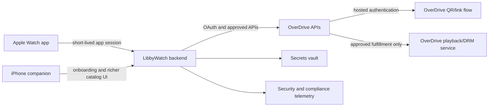

# Architecture

## Proposed system

The playback service in this diagram is a required external contract, not an available public endpoint. Implementation is blocked until OverDrive approves the mechanism.

## Components

### Apple Watch app

- SwiftUI watchOS application capable of running independently of iPhone.
- `AVAudioSession` configured for long-form background playback and Bluetooth routing.
- Playback coordinator, chapter queue, sleep timer, speed control, and Now Playing integration.
- Background-capable downloads and protected local storage.
- Entitlement state machine that fails closed on expiration or revocation.
- Local progress journal that tolerates offline operation and app termination.

### iPhone companion

- Optional but recommended onboarding, authentication handoff, catalog discovery, and support UI.
- Does not contain OverDrive client credentials.
- Shares only product state that is allowed by OverDrive and is safe to synchronize.
- The watch remains functional without the phone after setup where platform and OverDrive rules permit.

### Backend

- Holds OverDrive client credentials in a managed secrets service; apps receive only short-lived, audience-bound LibbyWatch sessions.
- Initiates QR/link authentication and exchanges authorization codes with OverDrive over TLS.
- Refreshes patron access in accordance with the documented one-hour access-token and 30-day QR refresh-token behavior.
- Uses patron collection tokens for user-specific Discovery calls and refreshes them each session.
- Follows hypermedia links instead of constructing undocumented fulfillment URLs.
- Implements bounded retries, caching only where allowed, request attribution, service health, incident evidence, and required session-data export.

### Data stores

- Store the minimum data necessary for account linkage, device sessions, progress, consent, and compliance evidence.
- Do not store patron collection tokens unless OverDrive explicitly permits it; current guidance recommends refreshing them each session.
- Do not store OverDrive-sourced end-user data unless OverDrive explicitly identifies it in writing as storable.
- Separate security/audit events from product analytics and do not use OverDrive API data to establish identities or customer profiles.
- Attach retention and deletion rules to every stored field before production.

## Security boundaries

- Client key and secret exist only on the backend in a controlled secrets store.
- Patron library credentials are entered only into an OverDrive/library-hosted experience under the QR/link flow.
- Tokens are encrypted at rest, redacted from telemetry, scoped, rotated, and revoked on sign-out or suspected compromise.
- Media URLs, licenses, and files are treated as sensitive bearer material.
- Downloads are protected according to OverDrive DRM instructions and become cryptographically or logically unusable when the loan is invalid.
- Every OverDrive request uses TLS and an approved, attributable User-Agent.

## Key state machines

### Entitlement

`unknown → checking → active → grace-if-approved → expired/returned/revoked → deleted`

The application never invents a grace period. If offline grace is not explicitly approved, inability to establish entitlement at a required check fails closed.

### Download

`not-downloaded → queued → downloading → verifying → available → invalidating → deleted`

### Playback

`idle → requesting-route → buffering → playing ↔ paused → interrupted → recovering → ended/error`

## API behavior

- Decode responses defensively: documented fields may be absent/null and new fields may appear.
- Use API-provided links and action templates as the source of allowed operations.
- Refresh metadata at least every 24 hours and remove unavailable content within 24 hours; active loans require a much tighter entitlement cadence.
- Support borrow and hold paths across lending models and user-specific Advantage collections.
- Poll the OverDrive monitoring endpoint no more than once per minute; five minutes is the documented frequent-polling recommendation.

## Prototype seam

All OverDrive dependencies sit behind protocols such as `CatalogService`, `CirculationService`, `EntitlementService`, `PlaybackManifestService`, and `ProgressSyncService`. Until approval, implementations use deterministic fixtures and licensed public-domain audio. No Libby software, private endpoint, or extracted content is used for prototype development.
